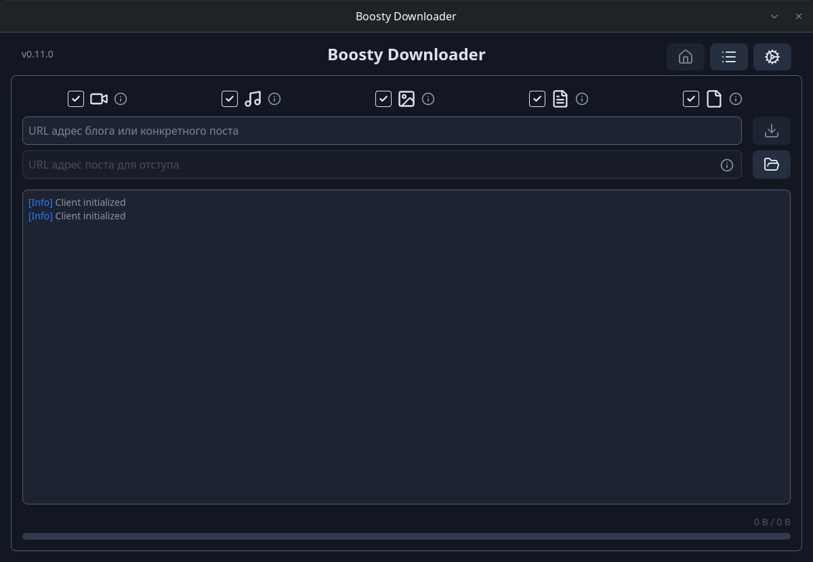
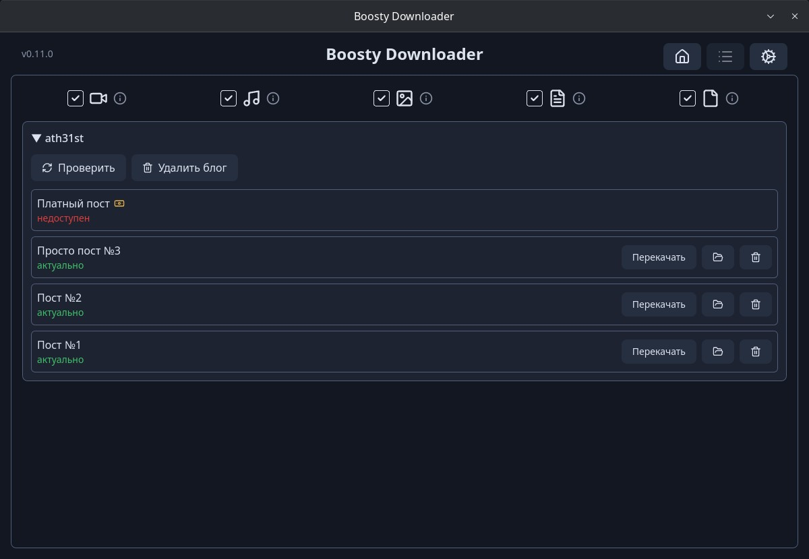
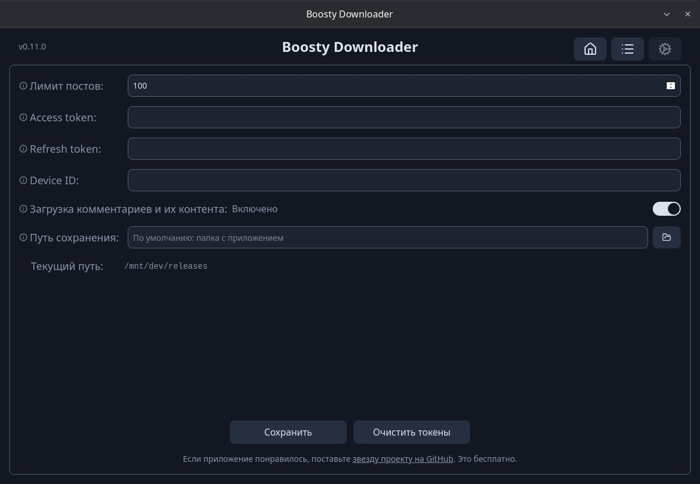
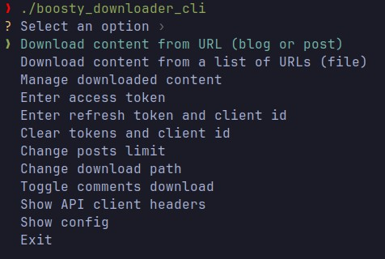
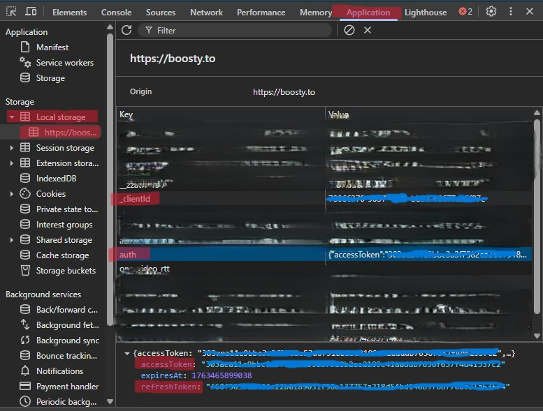
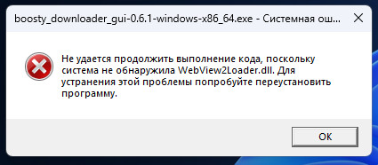
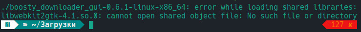

# Boosty Downloader


## Оглавление

- [Версия приложения](#версия-приложения)
- [Описание](#описание)
- [Отказ от ответственности](#отказ-от-ответственности)
- [Статус проекта](#статус-проекта)
- [Использование готовых исполняемых файлов приложения](#использование-готовых-исполняемых-файлов-приложения)
- [Самостоятельная сборка приложения из исходников](#самостоятельная-сборка-приложения-из-исходников)
- [Особенности](#особенности)
- [Управление скачанным](#управление-скачанным)
- [Ограничения](#ограничения)
- [Где взять токены?](#где-взять-токены)
- [Возможные проблемы](#возможные-проблемы)
- [В планах](#в-планах)
- [Лицензия](#лицензия)

## Версия приложения

### 0.16.0/0.11.0

## Описание

Boosty Downloader — portable приложение для загрузки контента (видео, аудио, изображения, текст, файлы и ссылки)
с платформы Boosty. Можно скачать отдельный пост, доступные посты блога или посты из бандла (с учётом лимита),
а затем проверять уже скачанное: докачивать новое, перекачивать и удалять. Существует в двух версиях: консольной
и графической. Обе поддерживают Linux и Windows.

## Отказ от ответственности

Это приложение предназначено только для исследовательских и личных целей.
Используя его, вы соглашаетесь:

- Получать доступ только к вашему собственному контенту на платформе Boosty.
- Не заниматься скрапингом, распространением или иным неправомерным использованием контента, который вам не принадлежит.
- Соблюдать [Условия использования](https://boosty.to/terms) платформы Boosty и применимые законы об авторском праве.

## Статус проекта

Приложение находится в стадии активной разработки. Во время использования приложения вам могут встречаться различные ошибки. Для вывода более подробных сообщений об ошибках используйте `_debug` версию приложения. Пожалуйста, сообщите об этом [на GitHub](https://github.com/ath31st/boosty_downloader/issues/new) или [в Telegram](https://t.me/feedback_genie_bot).

Функциональность приложения будут изменяться и расширяться в будущем.

## Использование готовых исполняемых файлов приложения

1. Скачайте последнюю версию приложения `boosty_downloader` для вашей операционной системы
   с [релизов на GitHub](https://github.com/ath31st/boosty_downloader/releases).
2. Запуск приложения

   2.1. **Графическая версия (GUI)**

   
   
   

   В GUI три экрана: **Загрузка** (URL, прогресс и логи), **Скачанное** (список блогов и постов) и **Настройки**.

   Запустите графическое приложение в зависимости от вашей системы:
    - **Windows**: Дважды щёлкните по файлу `boosty_downloader_gui-x.x.x-windows-x86_64.exe`.
    - **Linux**:
        1. Откройте терминал в папке с загруженным файлом.
        2. Сделайте файл исполняемым командой:
           ```bash
           chmod +x boosty_downloader_gui-x.x.x-linux-x86_64
           ```
        3. Запустите приложение:
           ```bash
           ./boosty_downloader_gui-x.x.x-linux-x86_64
           ```

   2.2. **Консольная версия (CLI)**

   

   Запустите консольное приложение в зависимости от вашей системы:
    - **Windows**: Дважды щёлкните по файлу `boosty_downloader_cli-x.x.x-windows-x86_64.exe`.
    - **Linux**:
        1. Откройте терминал в папке с загруженным файлом.
        2. Сделайте файл исполняемым командой:
           ```bash
           chmod +x boosty_downloader_cli-x.x.x-linux-x86_64
           ```
        3. Запустите приложение:
           ```bash
           ./boosty_downloader_cli-x.x.x-linux-x86_64
           ```

   В CLI пункт **Manage downloaded content** — третья строка главного меню (сразу после загрузки по URL и из файла).

## Самостоятельная сборка приложения из исходников

### Требования
- Установленный [Rust](https://www.rust-lang.org/tools/install).
- Для **GUI на Linux**: `libwebkit2gtk-4.1-dev`.
  ```bash
  sudo apt install libwebkit2gtk-4.1-dev
  ```

### Клонирование
```bash
git clone https://github.com/ath31st/boosty_downloader.git
cd boosty_downloader
```

### Сборка
**CLI версия:**
```bash
cargo build --release --bin boosty_downloader_cli
```

**GUI версия:**
```bash
cargo build --release --bin boosty_downloader_gui
```

### Запуск
Бинарники находятся в `target/release/`.

**Linux:**
```bash
./target/release/boosty_downloader_cli
```

**Windows:**
Запустите `target\release\boosty_downloader_cli.exe`.

## Особенности

- Проверка доступности Boosty API.
- Поддержка асинхронной загрузки с использованием tokio.
- Двухуровневый прогресс загрузки: общий счётчик файлов и прогресс текущего файла (CLI и GUI).
- В GUI можно остановить текущую загрузку или проверку кнопкой «Стоп».
- Сначала обрабатываются посты, затем комментарии; ошибка по одному элементу не останавливает всю сессию.
- Обработка ошибок с выводом через общий logger (в GUI и CLI; подробнее в debug-версии).
- Авторизация через access token или через связку refresh token + device ID (client ID из браузера).
- Если заданы refresh token и device ID, приложение получает новый access token через refresh и сохраняет оба токена в конфиг. Токены можно очистить в настройках / CLI.
- Выбор типа контента (по умолчанию все) для загрузки. Фильтры применяются и на содержимое комментариев.
- Настраиваемое количество закачиваемых постов (по умолчанию 100). Лимит действует и для ленты блога, и для бандла.
- Поддерживаемые URL для загрузки:
  - блог: `https://boosty.to/{blog}`
  - пост: `https://boosty.to/{blog}/posts/{post_id}`
  - бандл: `https://boosty.to/{blog}/bundle/{bundle_id}` (query-параметры вроде `?isFromShowcasePreview=true` игнорируются)
- Для бандла скачиваются только посты из этого бандла; они сохраняются в папку блога, как обычные посты. Поле отступа (offset) для бандла не используется — только для ленты блога.
- Настраиваемый путь сохранения контента (по умолчанию папка с приложением).
- Вместе с постами закачиваются комментарии и их контент.
- Для каждого поста формируется `index.html` с локальными ссылками на скачанные файлы, шапкой (название, дата, автор, теги) и комментариями. Откройте этот файл в браузере, чтобы просмотреть пост.
- Папка поста: `{дата} {название} [{id}]`. Имена постов и сохранённых папок могут не совпадать — так безопаснее для файловой системы.
- Повторная загрузка того же поста (по `id`) идёт в ту же папку, а не создаёт дубликат.
- Управление уже скачанным: проверка обновлений, докачка, перезакачка, удаление поста или блога (GUI и CLI). См. [Управление скачанным](#управление-скачанным).
- Платный пост без доступа не скачивается, а пропускается; в списке он помечается как недоступный.
- Таймаут запросов между неудачными попытками с прогрессивным увеличением.

## Управление скачанным

После первой загрузки блога, поста или бандла (посты попадают в папку блога) он появляется в списке скачанного. В GUI это экран **Скачанное**, в CLI — пункт **Manage downloaded content**.

Индекс блога хранится в файле `{путь сохранения}/{блог}/.boosty.json`. По `id` поста приложение находит папку, помнит, какие типы контента уже скачаны, и не создаёт вторую папку при повторной загрузке. Посты, скачанные старыми версиями без этого файла, в списке не появятся — их нужно скачать заново.

**Проверка** сверяет локальные посты с Boosty и подтягивает новые из ленты (в пределах лимита постов из настроек). Без проверки статусы — «не проверен», кнопки «Скачать новое» нет: ещё неизвестно, есть ли новое.

Статусы после проверки:

| Статус | GUI | Смысл |
| --- | --- | --- |
| `unchecked` | не проверен | Список с диска, API ещё не опрашивали |
| `up_to_date` | актуально | Совпадает с сервером |
| `new` | новый | Есть на Boosty, ещё не скачан, доступ есть |
| `updated` | есть изменения | На сервере пост новее локальной копии |
| `partial` | можно докачать | На сервере есть типы контента, которых нет локально |
| `unavailable` | недоступен | Нет доступа (часто платный пост без подписки) |
| `gone` | больше нет | Пост удалён на Boosty |

Платные посты помечаются значком денег (GUI) или `[paid]` (CLI). Если доступа нет, загрузка пропускается — это не считается успешной докачкой.

Действия:

- **Скачать / Скачать новое** — только для статуса «новый», после проверки. В GUI прогресс и логи показываются на экране **Загрузка**.
- **Докачать** — только если статус «можно докачать». Для «актуально» кнопки нет.
- **Перекачать** — очищает папку поста и качает заново. Перед этим запрашивается подтверждение. Для статуса «есть изменения» отдельной кнопки нет: используйте перекачку.
- **Открыть папку** / удалить пост или блог — удаление тоже с подтверждением.

В CLI те же действия: Check blog, Show posts, Download new posts, Download / resume post, Redownload post, Delete post, Delete blog.

Результаты проверки в GUI сохраняются, пока приложение открыто: можно переключаться между экранами, не проверяя блог заново.

Не удаляйте и не переименовывайте `.boosty.json` и папки постов вручную: индекс перестанет совпадать с диском.

## Ограничения

- Для загрузки платного контента (в том числе бандла) **необходим** access token и оплаченная подписка / доступ к посту или бандлу. Иначе пост будет пропущен.
- Для загрузки аудио и прикрепленных файлов так же **необходим** access token, даже если пост бесплатный и открытый для всех.
- Проверка блога смотрит ленту в пределах **лимита постов** из настроек (по умолчанию 100). Более старые новые посты за этим лимитом проверка может не увидеть. Для бандла действует тот же лимит: если постов в бандле больше, скачаются первые N по API.

## Где взять токены?

Залогиньтесь в Boosty (это обязательно), в браузере откройте инструменты разработчика (F12) и нажмите на вкладку "Application", затем выберите сбоку "Local Storage" и там сайт `https://boosty.to`. Внутри находятся различные ключи и значения, среди них вы найдете `auth` и `_clientId`. Токены копируйте **без кавычек**, `_clientId` там без кавычек. Если сразу не увидите ключ `auth`, то попробуйте обновить страницу (F5).



На примере красным выделены основные моменты, куда нажать и что там выбрать.
Для основных сценариев использования достаточно одного **access token** (у него достаточно большая длительность). Если хотите обновлять access через приложение, укажите **refresh token** (из `auth`) и **device ID** (значение `_clientId`). При сохранении настроек / вводе в CLI приложение выполнит refresh, получит новый access token и перезапишет его в конфиге вместе с обновлённым refresh token.

Важно: использование refresh token может сбросить текущую сессию на сайте Boosty. Если после этого вы снова залогинитесь в браузере, токены в приложении могут стать невалидными — тогда их нужно будет взять заново.

## Возможные проблемы

- Если возникнут проблемы с запуском на Windows из-за отсутствия WebView2Loader.dll.

   

   Скачайте архив с boosty_downloader_gui-x.x.x-windows-x86_64.zip [из релиза последней версии](https://github.com/ath31st/boosty_downloader/releases), распакуйте и запустите приложение, там уже будет нужная библиотека WebView2Loader.

- Если возникнут проблемы с запуском на Linux из-за необходимости установки библиотеки libwebkit2gtk-4.0-dev.

   

   Установите библиотеку командой:

   ```bash
   sudo apt install libwebkit2gtk-4.1-dev
   ```
   *Данная библиотека обеспечивает работу графической части приложения и позволяет сократить объем исполняемого файла до минимума.*

- В случае возникновения ошибок, связанных с авторизацией, нужно обновить токены в приложении ([см.](#где-взять-токены)). Если используете refresh + device ID, можно просто заново сохранить их в настройках — приложение получит новый access.
- В вечернее время возможны проблемы с доступом к Boosty API из-за нагрузки на сервер, приложение может не стартовать из-за провала проверки доступности Boosty API. В этом случае нужно повторить попытку через 5-10 минут.
- Не переименовывайте папки с блогами и постами и не трогайте `.boosty.json`. Иначе пост пропадёт из списка скачанного или будет скачан в другую папку.
- Если файл скачался не до конца: для недостающих типов контента нажмите **Докачать**; чтобы заменить всё содержимое папки — **Перекачать**. Удалять блог или пост можно из экрана «Скачанное» / меню CLI.
- Если с проблемой не удается справиться собственными силами, то можете обратиться к разработчику [на GitHub](https://github.com/ath31st/boosty_downloader/issues/new) или [в Telegram](https://t.me/feedback_genie_bot).

## В планах

- Доработки по обратной связи в Issues.

## Лицензия

[MIT License](LICENSE)