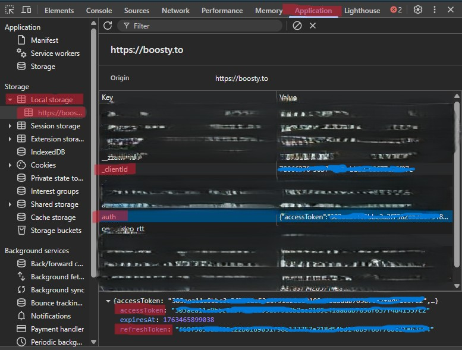

# Boosty Downloader


## Оглавление

- [Версия приложения](#версия-приложения)
- [Описание](#описание)
- [Отказ от ответственности](#отказ-от-ответственности)
- [Статус проекта](#статус-проекта)
- [Использование готовых исполняемых файлов приложения](#использование-готовых-исполняемых-файлов-приложения)
- [Самостоятельная установка и сборка](#самостоятельная-установка-и-сборка)
- [Использование](#использование)
- [Особенности](#особенности)
- [Ограничения](#ограничения)
- [Где взять токены?](#где-взять-токены)
- [Возможные проблемы](#возможные-проблемы)
- [В планах](#в-планах)
- [Зависимости](#зависимости)
- [Лицензия](#лицензия)

## Версия приложения

### 0.10.4

## Описание

Boosty Downloader - это консольное приложение для загрузки контента (видео, изображения, текст, файлы и ссылки)
с платформы Boosty. Оно поддерживает загрузку отдельных постов или всех доступных постов блога с учетом лимита.

## Отказ от ответственности

Это приложение предназначено только для исследовательских и личных целей.
Используя его, вы соглашаетесь:

- Получать доступ только к вашему собственному контенту на платформе Boosty.
- Не заниматься скрапингом, распространением или иным неправомерным использованием контента, который вам не принадлежит.
- Соблюдать [Условия использования](https://boosty.to/terms) платформы Boosty и применимые законы об авторском праве.

## Статус проекта

Приложение находится в стадии активной разработки. Во время использования приложения вам могут встречаться различные ошибки. Для вывода более подробных сообщений об ошибках используйте `_debug` версию приложения. Пожалуйста, сообщите об этом [на GitHub](https://github.com/ath31st/boosty_downloader/issues/new) или [в Telegram](https://t.me/feedback_genie_bot).

Функциональность приложения будут изменяться и расширяться в будущем.

## Использование готовых исполняемых файлов приложения

1. Скачайте последнюю версию приложения `boosty_downloader` для вашей операционной системы
   с [релизов на GitHub](https://github.com/ath31st/boosty_downloader/releases).
2. Запустите приложение в зависимости от вашей системы:
    - **Windows**: Дважды щёлкните по файлу `boosty_downloader-x.x.x-windows-x86_64.exe`.
    - **Linux**:
        1. Откройте терминал в папке с загруженным файлом.
        2. Сделайте файл исполняемым командой:
           ```bash
           chmod +x boosty_downloader-x.x.x-linux-x86_64
           ```
        3. Запустите приложение:
           ```bash
           ./boosty_downloader-x.x.x-linux-x86_64

## Самостоятельная установка и сборка

1. Убедитесь, что у вас установлен Rust (рекомендуется версия от 2024 edition и выше).
2. Клонируйте репозиторий:
   ```bash
   git clone https://github.com/ath31st/boosty_downloader.git
   cd boosty_downloader
   ```
3. Соберите проект:
   ```bash
   cargo build --release
   ```

## Использование

1. Запустите приложение:
   ```bash
   cargo run --release
   ```
2. Выберите опцию в меню:
    - 1: Загрузка контента по URL поста или блога.
    - 2: Установка access token для авторизации.
    - 3: Установка refresh token и client ID.
    - 4: Очистка access token, refresh token и client ID.
    - 5: Установка лимита постов.
    - 6: Показать заголовки API клиента.
    - 7: Показать текущие настройки.
    - 8: Выход.
3. При выборе загрузки введите URL поста или блога (например, `https://boosty.to/blog_name` или
   `https://boosty.to/blog_name/posts/post_id`).
4. Контент сохраняется в папку с именем блога.

## Особенности

- Проверка доступности Boosty API.
- Поддержка асинхронной загрузки с использованием tokio.
- Прогресс-бары для отслеживания загрузки файлов.
- Обработка ошибок с выводом в консоль (подробно в debug-версии приложения).
- Авторизация через access token или refresh token с client ID.
- Настраиваемое количество закачиваемых постов (по умолчанию 100).
- Вместе с постами закачиваются комментарии и их контент.
- Во время загрузки формируется .md файл, а потом из него .html с локальными ссылками на загруженный контент.
- Имена постов и сохраненных папок могут не совпадать, это сделано, чтобы не ломать пути в файловой системе вашей ОС.
- Таймаут запросов между неудачными попытками с прогрессивным увеличением.

## Ограничения

- Для загрузки защищенного контента **необходим** access token.
- Для загрузки аудио и прикрепленный файлов так же **необходим** access token, даже для публичных постов.

## Где взять токены?

Залогиньтесь в Boosty (это обязательно), в браузере откройте инструменты разработчика (F12) и нажмите на вкладку "Application", затем выберите сбоку "Local Storage" и там сайт `https://boosty.to`. Внутри находятся различные ключи и значения, среди них вы найдете `auth` и `_client_id`. Токены копируйте **без ковычек**, _client_id там без ковычек. Если сразу не увидите ключ `auth`, то попробуйте обновить страницу (F5).



На примере красным выделены основные моменты, куда нажать и что там выбрать.
Для основных сценариев использования достаточно одного **access token** (у него достаточно большая длительность). Если вы хотите автоматическое обновление токенов, то рекомендуется использовать **refresh token** и **client ID**, но они сбросят ваш текущий логин на странице Boosty и если вы там после этого перелогинитесь, то обнулите текущие токены в приложении и процесс авторизации надо будет начинать заново.

## Возможные проблемы

- В случае возникновения ошибок связанных с авторизацией - нужно обновить используемый токен в приложении ([см.](#где-взять-токены)).
- В вечернее время возможны проблемы с доступом к Boosty API из-за нагрузки на сервер, приложение может не стартовать из-за провала проверки доступности Boosty API. В этом случае нужно повторить попытку через 5-10 минут.
- Не переименовывайте папки с блогами и постами, в таком случае они будут перезагружены заново.
- Если есть подозрение, что какой-либо файл не загрузился до конца, то удалите его, он будет загружен заново. Так же можете удалять папки с постами и блогами, они будут перезагружены заново.
- Если с проблемой не удается справиться собственными силами, то можете обратиться к разработчику [на GitHub](https://github.com/ath31st/boosty_downloader/issues/new) или [в Telegram](https://t.me/feedback_genie_bot).

## В планах

- Сделать возможность автоматического извлечения аксесс и рефреш токенов из браузера.
- Расширить инструкцию по использованию приложения.

## Зависимости

- boosty_api: 0.19.0
- tokio: 1.45.1 (features: macros, rt-multi-thread, fs, process)
- reqwest: 0.12.19 (features: stream)
- anyhow: 1.0.98
- chrono: 0.4.42
- url: 2.5.4
- indicatif: 0.17.11
- futures-util: 0.3.31
- serde_json: 1.0.140
- sha2: 0.10.9
- comrak: 0.46.0
- once_cell = 1.21.3

## Лицензия

[MIT License](LICENSE)